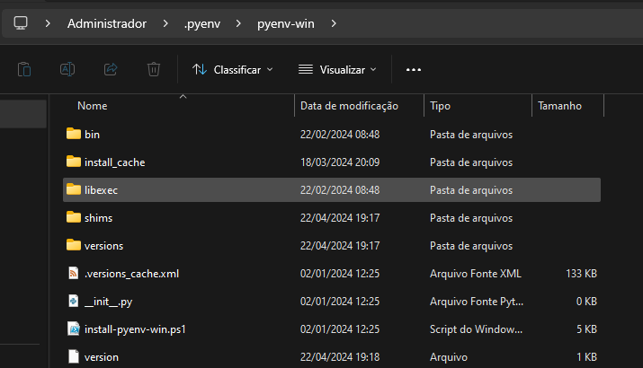

# Título 1

## Título 2

### Título 3

**Texto em negrito**

*Texto em itálico*

- Item 1
- Item 2
  - Subitem 2.1
  - Subitem 2.2

1. Primeiro item
2. Segundo item
3. Terceiro item


[Texto do link](URL)


### Citações


### Linhas horizontais


`Código em linha`

```python
# Bloco de código em Python
print("Olá, mundo!")

```


Essas são apenas algumas das formatações básicas disponíveis em Markdown. Existem muitas outras opções e variações, mas essas são as mais comuns.

## Limpeza do Ambiente Local antes de Iniciar um Projeto
Antes de iniciar um novo projeto, é altamente recomendável realizar uma limpeza do ambiente local do seu computador, removendo bibliotecas Python instaladas globalmente e desinstalando todas as versões do Pyenv que não são mais necessárias. Isso ajuda a garantir que o ambiente de desenvolvimento esteja limpo e preparado para o novo projeto, evitando conflitos de dependências e mantendo a integridade do ambiente de desenvolvimento.

Aqui estão algumas instruções para realizar essa limpeza:

### Remoção de Bibliotecas Python Global
Para remover bibliotecas Python instaladas globalmente, você pode usar o seguinte comando:
```bash
pip freeze | grep -v "^-e" | xargs pip uninstall -y
```
Este comando lista todas as bibliotecas Python instaladas globalmente, excluindo aquelas que são instaladas a partir de URLs (-e), e, em seguida, desinstala todas elas automaticamente.

## Remoção de Todas as Versões do Pyenv
Se deseja remover todas as versões do Pyenv, pode usar o seguinte script em shell:
```bash
#!/bin/bash

versions=$(pyenv versions --bare)

for version in $versions
do
    if [[ $version != "*" ]]; then
        echo "Removendo a versão $version..."
        pyenv uninstall $version
    fi
done

```
Este script obtém todas as versões do Pyenv e executa um loop sobre elas, desinstalando cada versão individualmente, exceto a versão atualmente em uso (indicada pelo asterisco * ao lado dela). Certifique-se de executar este script com cuidado, pois removerá permanentemente todas as versões do Python gerenciadas pelo Pyenv.

Realizar essa limpeza do ambiente local antes de iniciar um novo projeto pode ajudar a garantir que você tenha um ambiente de desenvolvimento limpo e configurado corretamente para o novo projeto.


## Primeiro passo a ser realizado é instalar o pyenv, no caso de SO Windows, usa o link abaixo:

O Pyenv é uma ferramenta útil para gerenciar ambientes Python em um sistema. Ele permite que você instale e gerencie várias versões do interpretador Python em um único ambiente, facilitando o desenvolvimento de projetos Python que podem requerer versões específicas do Python. Com o Pyenv, você pode criar ambientes isolados para diferentes projetos, garantindo que as dependências não entrem em conflito. Isso é especialmente útil quando você precisa trabalhar em projetos que exigem versões diferentes do Python ou quando precisa testar seu código em várias versões do Python. Em resumo, o Pyenv serve para facilitar o gerenciamento de múltiplas versões do Python em um sistema.

https://github.com/pyenv-win/pyenv-win

Logo após abre o PowerShell e colar esse código:

```
Invoke-WebRequest -UseBasicParsing -Uri "https://raw.githubusercontent.com/pyenv-win/pyenv-win/master/pyenv-win/install-pyenv-win.ps1" -OutFile "./install-pyenv-win.ps1"; &"./install-pyenv-win.ps1"
```

Após executar o comando mencionado, caso seja exibida uma mensagem de erro semelhante à mostrada na imagem abaixo, é necessário seguir os passos adicionais descritos a seguir.

](pic/erro_powershell.png)

#### Passo 1:<br>
Acessar as Variaveis de Ambiente 


#### Passo 2:
](pic/config_variavel_ambiente.png)



](pic/criando_variavel_ambiente.png)

](pic/editar_path.png)


Após a execução bem-sucedida do comando mencionado, você deve observar a mensagem exibida conforme ilustrado na imagem abaixo.

](pic/powershell.png)

Logo após verificar se o pyenv foi instado na maquina, basta acessar o bash e digitar o seguinte código:

```
$ pyenv install 3.12.1
```
](pic/pipinstallpyenv.png)

```
$ pyenv --version
```


```
$ pyenv versions
```
](pic/pyenvversions.png)

```
$ pyenv global 3.12.1
```
](<pic/pyenv global 3.12.1.png>)

```
$ pyenv local 3.12.1
```
](pic/configirando_pyenv_local.png)

## Preparação do Ambiente para Projeto Pandas

Este repositório contém os passos necessários para configurar o ambiente de desenvolvimento para um projeto utilizando a biblioteca Pandas.

### Passos

1. Navegue até o diretório do projeto:

    ```bash
    cd Aula_000_Preparacao_Ambiente/
    ```

2. Verifique o conteúdo do diretório:

    ```bash
    ls -la
    ```

3. Acesse o diretório do projeto Pandas:

    ```bash
    cd projeto_pandas/
    ```

4. Crie um ambiente virtual Python:

    ```bash
    python -m venv .venv
    ```

5. Ative o ambiente virtual:

    ```bash
    source .venv/Scripts/activate
    ```

6. Instale a biblioteca Pandas:

    ```bash
    pip install pandas
    ```

7. (Opcional) Atualize o pip, se necessário:

    ```bash
    python -m pip install --upgrade pip
    ```

](pic/instalando_pandas_venv.png)


## Instalação de pipx
Para garantir que o ambiente de desenvolvimento esteja configurado corretamente, é necessário instalar o pipx. O pipx é uma ferramenta que facilita a instalação e o gerenciamento de pacotes Python em ambientes isolados. Ele garante que as dependências de cada projeto sejam gerenciadas de forma separada, evitando conflitos entre versões de pacotes.

### Passos
```bash
pip install pipx
``` 
](pic/instalando_pipx.png)

## Instalação do Poetry
O Poetry é uma ferramenta de gerenciamento de dependências e de empacotamento para projetos Python. Ele simplifica o processo de gerenciamento de dependências, permitindo a especificação precisa das versões dos pacotes e garantindo a consistência do ambiente de desenvolvimento em diferentes máquinas.

### Passos
```bash
pipx install poetry --force
```
](pic/instalacao_poetry.png)

## Instalação do IPython
O IPython é um poderoso interpretador interativo para Python que oferece recursos adicionais e uma experiência aprimorada de programação interativa. Ele fornece uma interface de linha de comando mais avançada, facilitando o desenvolvimento e a depuração de código Python.

### Passos
```bash
pipx install ipython --force
```
](pic/instalacao_ipython.png)

## Instalação do IPython
O IPython é um poderoso interpretador interativo para Python que oferece recursos adicionais e uma experiência aprimorada de programação interativa. Ele fornece uma interface de linha de comando mais avançada, facilitando o desenvolvimento e a depuração de código Python.

### Utilização do IPython
Após a instalação, você pode iniciar o IPython digitando o seguinte comando no terminal:

](pic/utilizando_ipython.png)


## Utilização do Poetry para Gerenciamento de Projetos Python
O Poetry é uma ferramenta de gerenciamento de dependências e projetos Python que oferece uma maneira simplificada e eficiente de criar e gerenciar projetos Python. A seguir, estão listados os principais comandos e suas funções:

### Configuração de Ambiente Virtual Dentro do Projeto:

```bash
poetry config virtualenvs.in-project true
```
Este comando configura o Poetry para criar e gerenciar ambientes virtuais dentro do diretório do projeto, mantendo as dependências isoladas em cada projeto.

### Criação de um Novo Projeto Django:
````bash
poetry new projeto_django
````
Este comando cria um novo projeto Django chamado "projeto_django" dentro do diretório atual.

### Ativação do Ambiente Virtual e Definição da Versão do Python:
```bash
pyenv local 3.12.1
poetry env use 3.12.1
```
Esses comandos ativam o ambiente virtual criado pelo Poetry e definem a versão específica do Python a ser usada no projeto.

### Instalação de Dependências:

```bash
poetry add django
```
Este comando adiciona a biblioteca Django ao projeto, junto com suas dependências necessárias. O Poetry gerencia as dependências e as adiciona ao arquivo pyproject.toml.

### Remoção de Dependências:

```bash
poetry remove django
```
Este comando remove a biblioteca Django e suas dependências do projeto. O Poetry atualiza automaticamente o arquivo pyproject.toml para refletir as mudanças nas dependências.

### Resumo
O Poetry simplifica o processo de gerenciamento de projetos Python, permitindo a criação de ambientes virtuais isolados, a definição de dependências precisas e a instalação de pacotes de forma consistente. Este README fornece uma visão geral dos comandos básicos necessários para começar a trabalhar com o Poetry em seus projetos.

